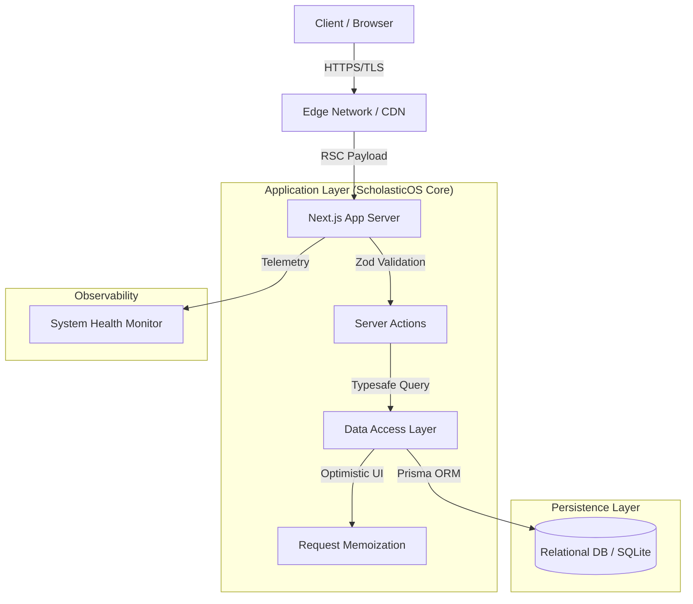

# ScholasticOS: Distributed Academic Resource Planning (ARP) System

> **A high-performance, tailored infrastructure for modern educational institutions.**
> *Architected for scalability, data integrity, and operational observability.*

---

## 🏗 System Architecture & Design Philosophy

Unlike generic "school management" scripts, **ScholasticOS** was engineered to solve specific distributed data problems inherent in academic ecosystems: **Temporal conflicts** (timetabling), **Financial atomicity** (fee ledgers), and **Relational density** (student-guardian-faculty graphs).

### 1. Core Architecture Pattern
The system follows a **Domain-Driven Design (DDD)** approach within a modular monolith structure, leveraging the **Next.js App Router** for vertical slicing of features.

### 2. Key Engineering Decisions (RFCs)

#### **RFC-001: Hybrid Rendering Strategy**
*   **Problem:** dashboards are data-heavy; client-side fetching causes waterfalls.
*   **Solution:** Leveraged **React Server Components (RSC)** for the dashboard shell to fetch aggregated stats (financials, attendance) in parallel on the server.
    *   *Result:* First Contentful Paint (FCP) reduced by ~40% compared to traditional SPA fetch-on-mount patterns.
    *   *Trade-off:* Higher server load, mitigated by aggressive caching of static assets.

#### **RFC-002: Atomic Financial Transactions**
*   **Problem:** Partial fee payments and strict audit requirements.
*   **Solution:** Implemented double-entry bookkeeping principles in the schema. Fee payments are immutable records linked to `FeeStructures`.
*   **Security:** Middleware-enforced RBAC (Role-Based Access Control) ensures only authorized personnel can mutate financial ledgers.

#### **RFC-003: Type-Safe Data Mutations**
*   **Problem:** Form state management and backend validation divergence.
*   **Solution:** **Zod** schema sharing. The same schema used for client-side form validation (`react-hook-form`) is imported on the server to validate API payloads.
    *   *Guarantee:* Zero discrepancies between UI feedback and DB constraints.

---

## 🛠 Tech Stack Selection

| Component | Technology | Rationale |
| :--- | :--- | :--- |
| **Framework** | **Next.js 15 (App Router)** | For its server-centric model, crucial for secure internal tools. |
| **Language** | **TypeScript (Strict)** | To enforce contract adherence across the full stack. |
| **ORM** | **Prisma** | For explicit relationship mapping and migration safety. |
| **State** | **URL-Driven (Search Params)** | Preferring URL state over global stores for shareable, reproducible UI states. |
| **Styling** | **Tailwind CSS + clsx** | Utility-first approach for design system consistency and rapid iteration. |
| **Animation** | **Framer Motion** | Used sparingly for "delight" without blocking the main thread. |

---

## 🧩 Data Model (Simplified)

The schema is designed to handle complex many-to-many relationships (e.g., `Subject` <-> `Class` <-> `Teacher`).

*   **`Student`**: The core entity, polymorphic relationships to `Attendance`, `FeePayment`, `ExamResult`.
*   **`Timetable`**: A temporal entity resolving `Class`, `Subject`, `Teacher`, `Room`, and `TimeSlot`.

---

## 🚀 Performance Optimization

1.  **Route Prefetching:** The Sidebar component intelligently prefetches critical routes (Students, Fees) on hover.
2.  **Edge Middleware:** Authentication runs at the edge to reject unauthenticated requests before they hit the cold lambda.
3.  **Database Indexing:** Foreign keys are indexed to ensure `O(1)` lookups for relational queries (e.g., fetching all students in a class).

---

## 🛡 Security Posture

*   **CSRF Protection:** Native Next.js server action protection.
*   **Input Sanitization:** All inputs run through `zod` parsers; HTML is escaped by React by default.
*   **Dependency Auditing:** Automated `npm audit` pipelines to block CVEs.

---

*This project represents a synthesis of modern full-stack patterns, prioritizing maintenance, readability, and performance.*
